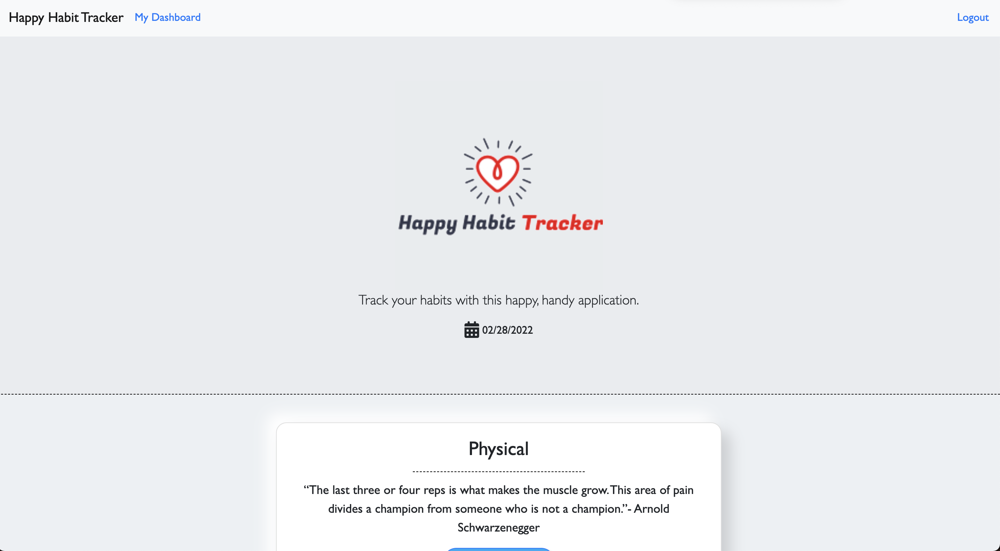
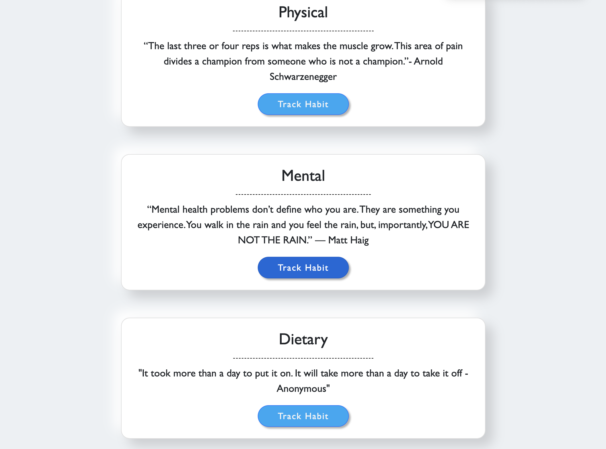
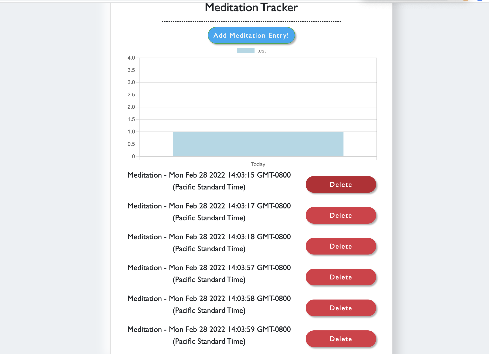

# Happy Habit Tracker

## Description

Track your dietary, physical, and mental health by utilizing this habit application! Users can select from a variety of habits and check out their habit history on an intuitive, dynamic chart.

## Table of Contents

1. [Installation](#installation)
2. [Usage](#usage)
3. [Contributing](#contributing)
4. [Screenshots](#screenshots)
5. [Links](#questions)

## Installation

First, install dependencies by using "npm i" in command-line. Then, run MYSQL to source the schema file. Third, run the seeds. Finally, boot up your server with "npm run" in command line and explore the application. Alternatively, head directly to the deployed application in Heroku.

## Usage

USER STORY: As a busy person with ambition, I want a way to track my mental and physical health habits so that I can stay on track and hold myself accountable.

## Contributing

This project was created by: As a busy person with ambition, I want a way to track my mental and physical health habits so that I can stay on track and hold myself accountable.

## Screenshots

## Links

### Repository

[GitHubRepo](https://github.com/chandrapanda/happy-habit-tracker)

### Heroku

[Heroku](https://happy-habit-tracker-app.herokuapp.com)

### GitHub

[GitHub](https://www.github.com/chandrapanda)

## License

[This application is licensed under MIT](https://opensource.org/licenses/MIT)

[Back to Top](#description)
